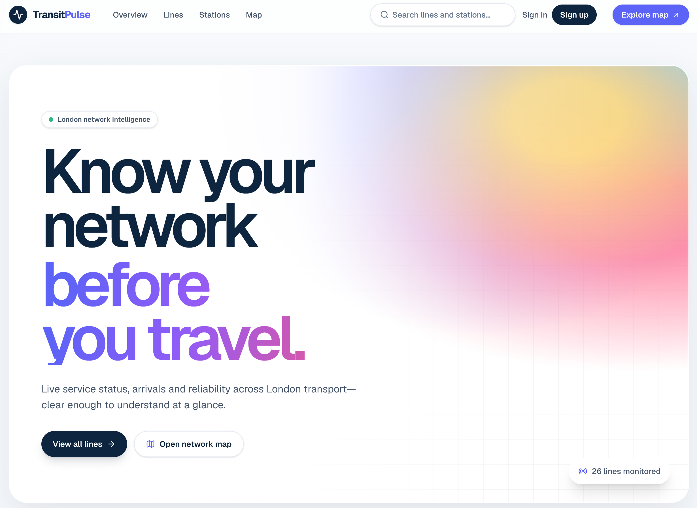

# TransitPulse

Know your network before you travel. TransitPulse is a London public
transport dashboard: live service status, arrivals, reliability, and
typical crowding, in one place.

[](https://github.com/andrewbaisden/transitpulse/actions/workflows/ci.yml)
[](https://github.com/andrewbaisden/transitpulse)
[](#license-and-responsible-use)



Open the overview to see which lines are running well and which are in
trouble. Open a line for its recent reliability and a short forecast. Open
a station for the next arrivals, a map pin, and how busy it usually is at
this time of day. Search from the header, or sign in and save the lines and
stations you actually use.

## What it does

- **Network overview.** Every monitored line on one page, with counts for
  good service, minor delays, and severe disruption.
- **Line pages.** Current status, the share of recent time spent in good
  service (and how much history that figure is based on), a plain-language
  note when reliability looks unusual, and a forecast taken from the line's
  own recent baseline. The forecast is labelled as a baseline, not a trained
  model.
- **Station pages.** Upcoming arrivals as of the moment the page loaded,
  the lines that stop there, a map of the station, and typical crowding.
  Crowding is Transport for London's historical "typical for this time"
  scale, and the screen says so.
- **Network map.** Stations with coordinates, on an OpenStreetMap basemap.
  No map API key.
- **Search.** Find a line or station by name.
- **Favourites.** Create an account and star lines and stations. Your list
  lives at `/favourites`.
- **Live status.** With the background worker running, open pages update
  their status badges when the recorded service status actually changes.

When a number is not available, the screen says it is not available. Demo
fixtures and scripted disruption scenarios stay labelled, including a
**Simulated** tag on scenario data, so they stay distinct from live
Transport for London data.

Built with Next.js, React, TypeScript, Tailwind CSS, PostgreSQL, Prisma,
Redis, and Leaflet. The full stack and the phase-by-phase build record are
in [SPECIFICATION.md](./SPECIFICATION.md).

## Getting started

### Prerequisites

- [Node.js](https://nodejs.org/) 24
- [pnpm](https://pnpm.io/) 12 (`packageManager` in `package.json` is pnpm 12.3.4)
- [Docker](https://www.docker.com/), for PostgreSQL and Redis

### Install

```bash
git clone git@github.com:andrewbaisden/transitpulse.git
cd transitpulse
pnpm install
cp .env.example .env
```

`.env.example` is enough to boot the app locally, except for the session
secret. Generate one and set `BETTER_AUTH_SECRET` in `.env`:

```bash
node -e "console.log(require('crypto').randomBytes(32).toString('hex'))"
```

### Environment variables

| Variable                   | Required | Purpose                                                                                          |
| -------------------------- | -------- | ------------------------------------------------------------------------------------------------ |
| `DATABASE_URL`             | Yes      | Postgres connection string. The example points at `localhost:5435`.                              |
| `REDIS_URL`                | Yes      | Redis connection string. Used by background jobs and live status updates.                        |
| `NEXT_PUBLIC_APP_NAME`     | Yes      | Name shown in the interface.                                                                     |
| `BETTER_AUTH_SECRET`       | Yes      | Signs session cookies. Generate your own. Do not reuse the placeholder.                          |
| `BETTER_AUTH_URL`          | Yes      | Public URL of this app. Defaults to `http://localhost:3000`.                                     |
| `NODE_ENV`                 | No       | `development`, `test`, or `production`. Defaults to `development`.                               |
| `TFL_APP_KEY`              | No       | TfL Unified API key. Required only to sync live TfL data and to read arrivals for TfL stops.     |
| `NEXT_PUBLIC_SENTRY_DSN`   | No       | Enables Sentry error reporting when set. Leave unset and reporting stays off.                    |
| `NEXT_PUBLIC_POSTHOG_KEY`  | No       | Enables PostHog analytics when set. Leave unset and analytics stay off.                          |
| `NEXT_PUBLIC_POSTHOG_HOST` | No       | PostHog ingest host. Defaults to `https://us.i.posthog.com`. Used only when the key above is set. |

### Set up the database and run

Postgres is published on port **5435** so it does not collide with another
local Postgres on 5432. Redis is on the usual port, 6379.

```bash
docker compose up -d
pnpm prisma migrate dev
pnpm db:seed
pnpm dev
```

Open [http://localhost:3000](http://localhost:3000).

`pnpm db:seed` loads the demo network (Central, Jubilee, and Elizabeth
lines, plus a handful of stations) through the same pipeline used for live
data. That is enough to click through the app with no TfL key.

### Live Transport for London data

Create a key at the [TfL API portal](https://api-portal.tfl.gov.uk), set
`TFL_APP_KEY` in `.env`, then:

```bash
pnpm db:sync:tfl   # lines, stops, and current status
pnpm worker        # keep status fresh and push changes to open pages
```

Leave `pnpm worker` running next to `pnpm dev`. It syncs the network every
few hours, samples status every couple of minutes, and publishes real status
changes to browsers that already have a page open.

A scripted disruption scenario can be loaded with `pnpm db:sync:simulation`.
Those rows always show a **Simulated** tag. Details are in
[SPECIFICATION.md](./SPECIFICATION.md).

### Checks

```bash
pnpm typecheck
pnpm lint
pnpm test            # Vitest: unit and component tests
pnpm test:e2e        # Playwright. See playwright.config.ts for how the app is started.
```

What each suite covers, and how the test database is set up, is in
[TESTING.md](./TESTING.md).

## Documentation

| Guide                                          | Read it for                                                                 |
| ---------------------------------------------- | --------------------------------------------------------------------------- |
| [SPECIFICATION.md](./SPECIFICATION.md)         | Product scope, data sources, stack, and the phase-by-phase build record    |
| [ARCHITECTURE.md](./ARCHITECTURE.md)           | System design, provider boundary, and data model                            |
| [DECISIONS.md](./DECISIONS.md)                 | Architecture decision records                                               |
| [TESTING.md](./TESTING.md)                     | How the test suites fit together and how to run them                       |
| [DEPLOYMENT.md](./DEPLOYMENT.md)               | Target hosting shape and release steps                                      |
| [AGENTS.md](./AGENTS.md)                       | Conventions for people and coding agents changing this repo                 |
| [AI_ENGINEERING.md](./AI_ENGINEERING.md)       | How AI assistance was used on this project                                  |

## License and responsible use

**Release 0.1.0.** This repository does not include a software license
file. You can read the code and run it locally. Copying it into another
project needs the author's permission. A `LICENSE` file will replace this
note if one is added later.

TransitPulse is an independent project. It is not operated by Transport for
London, and it is not an official TfL service.

Live network data comes from the
[TfL Unified API](https://api-portal.tfl.gov.uk). Use of that data follows
the [TfL transport data service terms](https://tfl.gov.uk/corporate/terms-and-conditions/transport-data-service).
If you run this app against a TfL key, keep TfL's attribution, including
"Powered by TfL Open Data", and do not imply that TfL endorses the
product. The map uses OpenStreetMap tiles, and the map itself keeps that
attribution on screen.

Anyone running or extending TransitPulse should keep these rules:

- If a value was not returned by a real source, say it is unavailable.
  Do not fill the gap with a plausible arrival time, delay, or crowd level.
- Crowding is TfL's typical, historical loading for this time of day. Keep
  that label. It is not a live count of people on the platform.
- Demo fixtures and simulation output stay visually distinct from live TfL
  data. Simulation always carries a **Simulated** tag.
- The app does not collect device location or GPS. Accounts store a name,
  an email address, and a hashed password. There is no email verification
  and no separate email-sending service.

How to deploy the app, the worker, Postgres, and Redis together is in
[DEPLOYMENT.md](./DEPLOYMENT.md).
